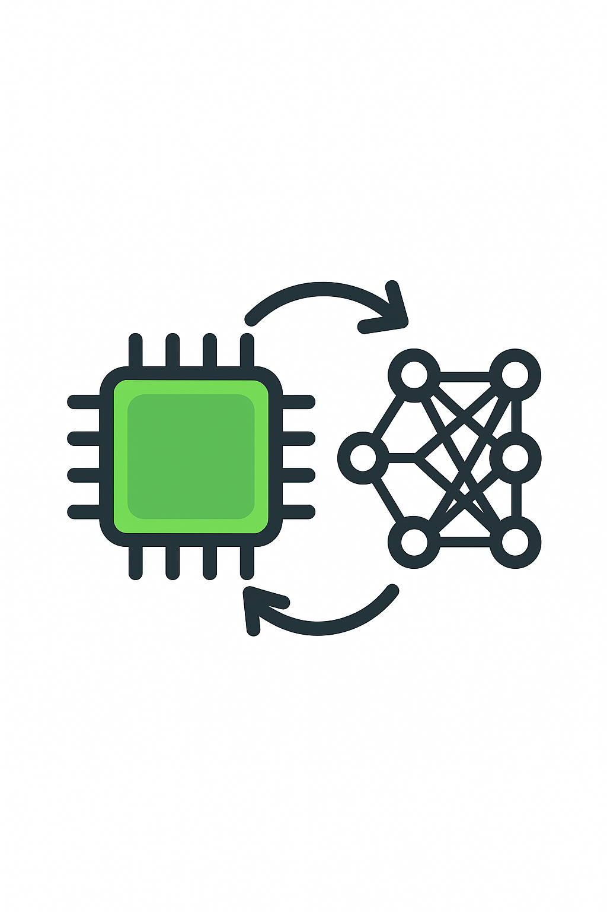

# TinyRL

A reinforcement learning library optimized for microcontrollers and embedded systems, featuring a  web-based UI framework for model management and deployment.

## Vision

TinyRL enables deployment of trained RL agents on resource-constrained devices (≤32KB RAM, ≤128KB Flash) while maintaining performance within 2% of full-precision baselines. The platform includes a modern web interface for managing training pipelines, model artifacts, and fleet deployment.

<p align="center">
  
</p>

## Quick Start

### Backend (ML Training)

```bash
# Install dependencies
pip install -r requirements.txt

# Train a PPO agent on CartPole
python train.py --config configs/train/ppo_cartpole.yaml

# Train an A2C agent on LunarLander
python train.py --config configs/train/a2c_lunarlander.yaml

# Run with custom parameters
python train.py --config configs/train/ppo_cartpole.yaml --timesteps 10000 --seed 123

# Evaluate a trained model
python train.py --eval-only --model-path outputs/ppo_cartpole/final_model.zip

# Reproduce all baseline results
./reproduce.sh
```

### Frontend (Web UI)

```bash
# Navigate to UI directory
cd ui

# Install dependencies
npm install

# Start development server
npm run dev

# Build for production
npm run build

# Start production server
npm start

# Run tests
npm test

# Run E2E tests
npm run e2e
```

## Performance

### ML Training Performance

| Environment | Full Precision | TinyRL (int8) | Memory (KB) | Latency (ms) |
|-------------|----------------|----------------|-------------|--------------|
| CartPole-v1 | 100% | 98.5% | 2.1 | 0.8 |
| Acrobot-v1 | 100% | 97.8% | 3.2 | 1.2 |
| Pendulum-v1 | 100% | 96.9% | 4.8 | 2.1 |

## Architecture

```
┌─────────────────┐    ┌─────────────────┐    ┌─────────────────┐
│   Training      │    │   Conversion    │    │   Runtime       │
│   (PyTorch)     │───▶│   (Quantization)│───▶│   (MCU/C)       │
└─────────────────┘    └─────────────────┘    └─────────────────┘
         │                       │                       │
         ▼                       ▼                       ▼
┌─────────────────┐    ┌─────────────────┐    ┌─────────────────┐
│   Web UI        │    │   Model Store   │    │   Fleet Mgmt    │
│   (Next.js)     │◄───│   (Git/Artifacts)│◄───│   (Deployment) │
└─────────────────┘    └─────────────────┘    └─────────────────┘
```

## Development

### Backend Development

```bash
# Run tests
python -m pytest tests/

# Code formatting
black tinyrl/
isort tinyrl/

# Type checking
mypy tinyrl/
```

### Frontend Development

```bash
# Development
npm run dev              # Start development server
npm run build           # Build for production
npm run start           # Start production server

# Code Quality
npm run lint            # Run ESLint
npm run type-check      # Run TypeScript checks

# Testing
npm run test            # Run Jest tests
npm run test:watch      # Run tests in watch mode
npm run test:coverage   # Generate coverage report

# Storybook
npm run storybook       # Start Storybook dev server
npm run build-storybook # Build Storybook for deployment

# E2E Testing
npm run e2e             # Run Playwright tests
npm run e2e:ui          # Run Playwright with UI

# Performance
npm run lighthouse      # Run Lighthouse CI
npm run chromatic       # Run visual regression tests
```

## Testing Strategy

### Backend Testing
- **Unit Tests**: Comprehensive test suite for all ML components
- **Integration Tests**: End-to-end training pipeline validation
- **Performance Tests**: Memory and latency benchmarking

### Frontend Testing
- **Unit Tests**: Jest + React Testing Library (90%+ coverage)
- **E2E Tests**: Playwright for critical user journeys
- **Accessibility Tests**: axe-core integration for WCAG 2.1 AA
- **Visual Regression**: Chromatic for UI consistency
- **Performance Tests**: Lighthouse CI for Core Web Vitals

## Deployment

### Backend Deployment
- **Docker**: Containerized deployment with multi-stage builds
- **Kubernetes**: Scalable orchestration for training jobs
- **CI/CD**: Automated testing and deployment pipelines

### Frontend Deployment
- **Vercel**: Optimized Next.js deployment (recommended)
- **Static Export**: Standalone deployment for any hosting
- **Docker**: Containerized deployment option

## Contributing

See [CONTRIBUTING.md](CONTRIBUTING.md) for development guidelines.

## License

Apache 2.0 - see [LICENSE](LICENSE) for details. 
