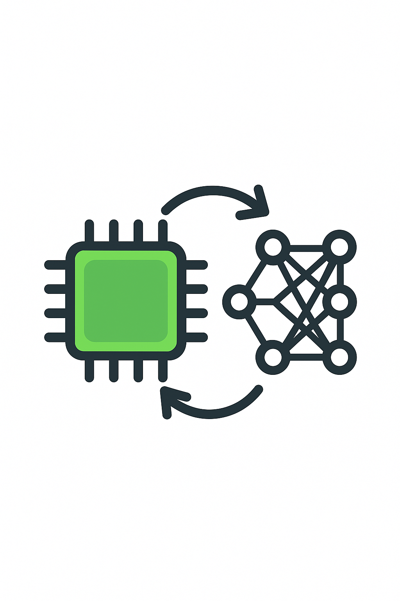
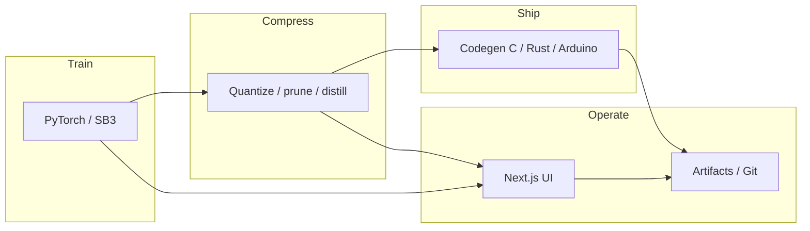

<div align="center">

# TinyRL

**Reinforcement learning that survives the trip from GPU to microcontroller.**

Train with PyTorch and Stable-Baselines3, compress for flash and RAM you can count in kilobytes, and manage experiments through a modern web UI.

<br/>

[](LICENSE)
[](pyproject.toml)
[](ui/)

**[Documentation](#documentation)** · **[Security](SECURITY.md)** · **[Contributing](CONTRIBUTING.md)**

<br/>



<br/>

</div>

---

## Why TinyRL

| | |
|:---|:---|
| **Tight budgets** | Targets that feel real on-device: on the order of tens of KB RAM and hundreds of KB flash—not datacenter assumptions. |
| **Full pipeline** | Training, distillation, quantization, pruning, and MCU-oriented codegen in one coherent library—not a loose bag of scripts. |
| **Observable** | Optional Weights & Biases, CSV, and a Next.js UI so teams can see models and runs without living only in terminal scrollback. |
| **Engineering hygiene** | `pyproject.toml` packaging, Ruff, pytest markers, MkDocs API pages, Docker image, and GitHub Actions for Python and UI. |

---

## Quick start

### Python (training stack)

Requires **Python 3.10+**. From the repository root:

```bash
pip install -e .
pip install -e ".[dev,docs]"   # optional: lint, tests, MkDocs
```

```bash
python train.py --config configs/train/ppo_cartpole.yaml --no-wandb
python train.py --config configs/train/a2c_lunarlander.yaml --no-wandb
```

Handy flags: `--timesteps`, `--seed`, `--no-wandb`, `--eval-only --model-path …`. On Unix you can run `./reproduce.sh` when present.

**Optional extras** (see [`pyproject.toml`](pyproject.toml)):

| Extra | Install |
|:------|:--------|
| Atari | `pip install -e ".[atari]"` |
| MuJoCo | `pip install -e ".[mujoco]"` |
| Embedded tooling | `pip install -e ".[embedded]"` |
| Verification (Z3) | `pip install -e ".[verify]"` |

### Web UI

Requires **Node.js 20+**. See [`ui/README.md`](ui/README.md) for detail.

```bash
cd ui && npm ci && npm run dev
```

---

## Indicative results

Illustrative numbers from project baselines (environment and hardware dependent):

| Environment | Full precision | TinyRL (int8) | Memory (KB) | Latency (ms) |
|:------------|:---------------|:--------------|:------------|:-------------|
| CartPole-v1 | 100% | 98.5% | 2.1 | 0.8 |
| Acrobot-v1 | 100% | 97.8% | 3.2 | 1.2 |
| Pendulum-v1 | 100% | 96.9% | 4.8 | 2.1 |

---

## Architecture


```mermaid
flowchart LR
  subgraph phaseTrain [Train]
    T[PyTorch / SB3]
  end
  subgraph phaseCompress [Compress]
    Q[Quantize / prune / distill]
  end
  subgraph phaseShip [Ship]
    C[Codegen C / Rust / Arduino]
  end
  subgraph phaseOps [Operate]
    U[Next.js UI]
    A[Artifacts / Git]
  end
  T --> Q --> C
  T --> U
  Q --> U
  C --> A
  U --> A
```

---

## Documentation

| What | How |
|:-----|:----|
| **User guide & API** | `pip install -e ".[docs]"` then `mkdocs serve` at repo root |
| **Security policy** | [SECURITY.md](SECURITY.md) |
| **Contributor workflow** | [CONTRIBUTING.md](CONTRIBUTING.md) |
| **UI-only README** | [ui/README.md](ui/README.md) |

---

## Development

**Python**

```bash
pytest tests/ -m "not slow"    # matches default CI breadth
pytest tests/                  # includes slow training smoke
ruff check tinyrl tests && ruff format tinyrl tests
mypy tinyrl/
```

**UI** (from `ui/`)

| Command | Purpose |
|:--------|:--------|
| `npm run dev` | Dev server |
| `npm run build` / `npm start` | Production build & serve |
| `npm run lint` / `npm run type-check` | ESLint, TypeScript |
| `npm test` | Jest |
| `npm run e2e` | Playwright |
| `npm run storybook` | Component explorer |
| `npm run chromatic` | Visual regression (needs `CHROMATIC_PROJECT_TOKEN`) |

**CI:** [`.github/workflows/ci-python.yml`](.github/workflows/ci-python.yml) (Ruff, pytest, Bandit, `pip-audit`, docs, Docker/Trivy where enabled) and [`.github/workflows/ci-ui.yml`](.github/workflows/ci-ui.yml) (lint, types, tests, build).

---

## Testing & quality

- **Python:** pytest with markers `unit`, `integration`, `slow` (see `pyproject.toml`). Coverage: `pytest tests/ --cov=tinyrl`.
- **UI:** Jest for units; Playwright for journeys (Chromium on `main` in CI). Storybook, Lighthouse, Chromatic, and axe tooling are available via npm scripts for deeper passes.

---

## Deployment

| Surface | Notes |
|:--------|:------|
| **Docker** | Root [`Dockerfile`](Dockerfile) for the training CLI image; CI may scan with Trivy. |
| **UI** | Vercel or any Node host; static export possible depending on your Next.js config. |
| **Orchestration** | No Kubernetes manifests in-repo; bring your own for fleet-scale training. |

---

## Contributing

Issues and PRs welcome. Read [CONTRIBUTING.md](CONTRIBUTING.md) for style (Ruff, pre-commit), tests, and review expectations.

---

## License

Apache License 2.0 — see [LICENSE](LICENSE).
