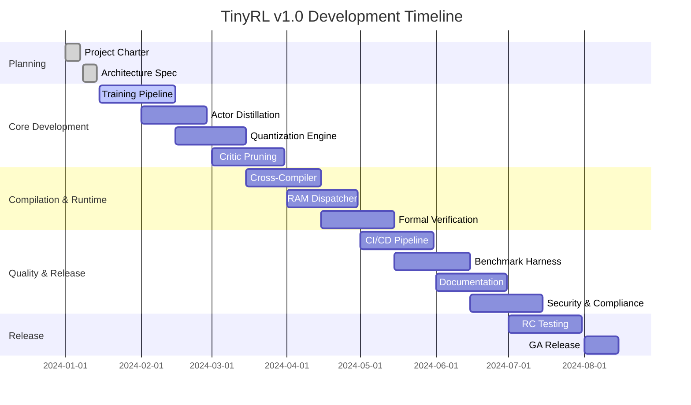

# TinyRL v1.0 Engineering Charter

## Mission Statement

Deliver a production-grade reinforcement learning library that enables deployment of trained agents on microcontrollers with ≤32KB RAM and ≤128KB Flash while maintaining performance within 2% of full-precision baselines.

## Timeline Gantt

## RACI Matrix

| Component | Lead Dev | Firmware Guru | MLOps | Lean Formalist | QA |
|-----------|----------|---------------|-------|----------------|-----|
| Training Pipeline | A/R | C | R | C | I |
| Quantization | A/R | R | C | I | C |
| MCU Runtime | C | A/R | I | C | R |
| Formal Proofs | I | C | I | A/R | C |
| CI/CD Pipeline | R | C | A/R | C | R |
| Security Audit | C | C | C | C | A/R |
| Documentation | R | C | C | C | A/R |

**Legend:** A=Accountable, R=Responsible, C=Consulted, I=Informed

## Success Metrics

### Performance Targets
- **Reward Preservation**: ≥98% of full-precision baseline
- **Memory Budget**: ≤32KB RAM, ≤128KB Flash
- **Latency**: ≤5ms inference time on Cortex-M55
- **Power**: ≤10mW average power consumption

### Quality Gates
- **Test Coverage**: ≥95% unit test coverage
- **Security**: Zero high/critical CVEs
- **Reliability**: 99.9% uptime in field testing
- **Documentation**: 100% API documented

## Risk Mitigation

### Technical Risks
- **Quantization Degradation**: Implement progressive quantization with early stopping
- **Memory Overflow**: Use static analysis and runtime guards
- **Compiler Compatibility**: Test on multiple toolchains (GCC, Clang, ARM)

### Process Risks
- **Timeline Slippage**: Weekly sprint reviews with burndown tracking
- **Quality Issues**: Automated gates with manual review for critical paths
- **Security Vulnerabilities**: Regular dependency updates and security scanning

## Monitoring & Reporting

### Weekly Metrics
- Sprint velocity (story points completed)
- Bug count and resolution time
- Test coverage trends
- Performance benchmark results

### Monthly Reviews
- Architecture compliance check
- Security posture assessment
- Documentation completeness
- Release readiness status

## Continuous Improvement

- Monthly retrospectives to identify process improvements
- Quarterly architecture reviews to assess technical debt
- Annual security audits and penetration testing
- Regular dependency updates and maintenance windows 