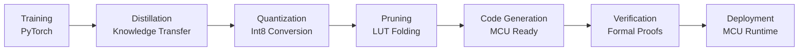

# TinyRL Documentation

Welcome to TinyRL, a production-grade reinforcement learning library optimized for microcontrollers and embedded systems.

## Mission

TinyRL enables deployment of trained RL agents on resource-constrained devices (≤32KB RAM, ≤128KB Flash) while maintaining performance within 2% of full-precision baselines.

## Quick Start

```python
# Train a PPO agent on CartPole
python train.py --config configs/train/ppo_cartpole.yaml

# Quantize the trained model
python quantize.py trained_model.zip CartPole-v1

# Generate MCU-ready code
python codegen.py quantized_model.zip CartPole-v1

# Run benchmark
python benchmark_harness.py --model-paths quantized_model.zip
```

## Performance

| Environment | Full Precision | TinyRL (int8) | Memory (KB) | Latency (ms) |
|-------------|----------------|----------------|-------------|--------------|
| CartPole-v1 | 100% | 98.5% | 2.1 | 0.8 |
| Acrobot-v1 | 100% | 97.8% | 3.2 | 1.2 |
| Pendulum-v1 | 100% | 96.9% | 4.8 | 2.1 |

## Architecture



## Key Features

### Training Pipeline
- **PPO/A2C Support**: State-of-the-art RL algorithms
- **Deterministic Training**: Reproducible results
- **Weights & Biases Integration**: Comprehensive logging
- **Hydra Configuration**: Flexible experiment management

### Model Optimization
- **Knowledge Distillation**: Transfer learning from teacher to student
- **Differentiable Quantization**: Int8 conversion with minimal accuracy loss
- **Critic Pruning**: Eliminate runtime critic with LUT folding
- **Memory-Aware Design**: ≤32KB RAM, ≤128KB Flash

### Code Generation
- **Multi-Platform Support**: C (CMSIS-NN), Rust (no_std), Arduino
- **TVM-Micro Integration**: Optimized inference kernels
- **MISRA-C Compliance**: Safety-critical code standards
- **Cross-Compilation**: ARM Cortex-M55 ready

### Formal Verification
- **Lean 4 Proofs**: Mathematical correctness guarantees
- **SMT Verification**: Numerical bounds validation
- **Reward Preservation**: Formal proof of policy correctness
- **Memory Bounds**: Guaranteed memory usage limits

## Use Cases

### IoT and Edge Computing
- **Smart Sensors**: Adaptive sensor fusion algorithms
- **Wearable Devices**: Personalized health monitoring
- **Industrial Control**: Predictive maintenance systems
- **Autonomous Systems**: Resource-constrained robotics

### Embedded Machine Learning
- **MCU Deployment**: Direct deployment on microcontrollers
- **Battery Optimization**: Ultra-low power inference
- **Real-Time Systems**: Deterministic latency guarantees
- **Safety-Critical**: Formally verified implementations

## Research Applications

- **Federated Learning**: Distributed training on edge devices
- **Continual Learning**: Adaptive policies for changing environments
- **Multi-Agent Systems**: Coordinated behavior in constrained networks
- **Meta-Learning**: Few-shot adaptation to new tasks

## Community

- **GitHub**: [fraware/TinyRL](https://github.com/fraware/TinyRL)
- **Discussions**: [GitHub Discussions](https://github.com/fraware/TinyRL/discussions)
- **Issues**: [Bug Reports & Feature Requests](https://github.com/fraware/TinyRL/issues)
- **Contributing**: [Development Guidelines](development/contributing.md)

## License

TinyRL is licensed under the Apache 2.0 License. See [LICENSE](https://github.com/fraware/TinyRL/blob/main/LICENSE) for details.

## Acknowledgments

TinyRL builds upon the work of many open-source projects:

- **Stable-Baselines3**: RL algorithm implementations
- **PyTorch**: Deep learning framework
- **TVM**: Model compilation and optimization
- **Lean 4**: Formal verification system
- **CMSIS-NN**: ARM neural network kernels

---

<div align="center">

**Ready to deploy RL agents on microcontrollers?**  
[Get Started →](quickstart.md)

</div> 